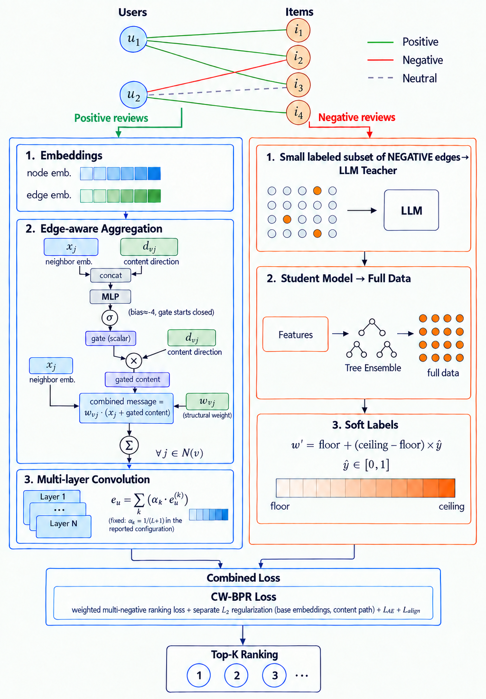

# GraphRec-Reviews

**Edge-Aware Review Injection and Confidence-Weighted Negative Feedback for Graph-Based Recommendation**

Official implementation accompanying the paper *"Edge-Aware Review Injection for Graph-Based Recommendation"* (submitted to *User Modeling and User-Adapted Interaction*, Springer) and the corresponding undergraduate thesis, *Graph-Based Recommender Systems Using User Reviews*.

[](https://www.python.org/)
[](https://pytorch.org/)
[](https://pytorch-geometric.readthedocs.io/)

---

## Table of Contents

- [Overview](#overview)
- [Architecture](#architecture)
- [Key Contributions](#key-contributions)
- [Key Results](#key-results)
- [Repository Structure](#repository-structure)
- [Installation](#installation)
- [Data Preparation](#data-preparation)
- [Reproducing the Experiments](#reproducing-the-experiments)
  - [Step 1: Build review embeddings](#step-1-build-review-embeddings)
  - [Step 2: Train the base and EdgeAware models](#step-2-train-the-base-and-edgeaware-models)
  - [Step 3: Confidence distillation pipeline (CW-BPR)](#step-3-confidence-distillation-pipeline-cw-bpr)
  - [Step 4: Ablation studies](#step-4-ablation-studies)
  - [Step 5: Aggregating and analyzing results](#step-5-aggregating-and-analyzing-results)
- [Command-Line Reference](#command-line-reference)
- [Evaluation Protocols](#evaluation-protocols)
- [Hardware Notes](#hardware-notes)
- [Known Limitations](#known-limitations)
- [Citation](#citation)
- [Acknowledgments](#acknowledgments)

---

## Overview

Graph neural networks over the user-item interaction graph now underpin most modern recommender systems, but they typically discard two signals that could sharpen the user model they build: the **free-text review** that accompanies a rating, and the fact that a **low rating does not always mean genuine dislike**.

This repository extends a LightGCN-style backbone ([ReFINe++](https://github.com/Chanwoo-Jeong-2000/ReFINe_plus), Jeong & Cho, IEEE Access 2025) with two orthogonal contributions:

1. **EdgeAwareLGConv** — a message-passing layer that keeps each review embedding bound to the *edge* it came from throughout propagation (rather than aggregating it into a node representation beforehand), with an optional per-edge, per-layer gate.
2. **CW-BPR** — a confidence-weighted ranking loss in which a small fixed fraction of negative edges is labeled by an LLM (the *teacher*), a lightweight gradient-boosted model (the *student*) generalizes that judgment to the full negative set, and the resulting confidence reweights the BPR objective.

The two mechanisms are architecturally independent — the first changes how messages are built on positive edges, the second changes how the loss weighs negative edges — and can be enabled or disabled separately from the command line.

## Architecture

<p align="center">
  
</p>

*Figure 1. Overall architecture. A user-item interaction graph is partitioned into positive, negative, and neutral edges by rating. **Innovation 1** (left) injects review embeddings as edge features during graph propagation. **Innovation 2** (right) distills LLM-derived confidence over negative feedback onto a lightweight student model whose calibrated output reweights the ranking loss.*

## Key Contributions

| | Contribution | Where in code |
|---|---|---|
| **1** | **EdgeAwareLGConv**: review content stays attached to its source edge during message passing, with a learned per-edge, per-layer gate (initialized nearly closed) | `model.py` → `EdgeAwareLGConv` |
| **2** | **CW-BPR**: LLM-labeled small sample → LightGBM student → calibrated per-edge weights → weighted BPR loss | `scripts/negative_confidence_teacher.py`, `scripts/train_distillation_lightgbm.py`, `main.py` |
| **3** | A rigorous evaluation protocol: 8-seed averaging, paired significance testing across 12 metrics, hyperparameters locked before any final test-set run | `aggregate_results.py`, `scripts/select_best_checkpoint.py` |

## Key Results

Evaluated on three Amazon 2014 review categories (5-core), under the sampled 1-vs-99 ranking protocol, averaged over 8 seeds:

| Dataset | Base NDCG@10 | +EdgeAware NDCG@10 | Relative gain | Significant metrics (of 12) |
|---|---|---|---|---|
| Toys and Games | 0.2902 | **0.3111** | +7.2% | 12 / 12 |
| Video Games | 0.4073 | **0.4358** | +7.0% | 12 / 12 |
| Grocery and Gourmet Food | 0.2967 | **0.3124** | +5.3% | 12 / 12 |

All 36 paired comparisons (12 metrics × 3 datasets) reach $p < 2 \times 10^{-4}$ and survive Bonferroni correction.

**What we find, honestly:**

- **Injecting review content at the edge level improves every ranking metric on every dataset tested.** This is the paper's central, robustly-supported result.
- **An ablation isolating the gate** (`--disable_gate`) shows that the improvement stems from *where* content lives during propagation (on the edge, not the node), not from the gating mechanism itself: unconditional content injection performs at least as well as the gated variant on all three datasets, and significantly better on two. The gate is retained as a principled architectural option, but should not be treated as load-bearing at this scale.
- **CW-BPR yields a small, sign-inconsistent effect** (significant on 0–4 of 12 metrics per dataset). Our analysis attributes this to confirmed negative feedback occupying only 2–7% of the positive training graph, not to a flaw in the distillation procedure. See the paper (Sections 5.4–5.6) for the full discussion.

## Repository Structure

```
GraphRec-Reviews/
├── main.py                          # Training + evaluation entry point
├── model.py                         # ReFINe_plus, EdgeAwareLGConv, BPRLoss
├── data_loader.py                   # Graph construction from prepared CSVs
├── utils.py                         # EarlyStopping
├── aggregate_results.py             # Collect per-run metrics into one CSV
├── docs/
│   └── architecture.svg             # System architecture figure
└── scripts/
    ├── prepare_rating_based_dataset.py    # Raw Amazon JSON -> pos/neg/neutral CSVs
    ├── build_text_review_embeddings.py    # Sentence-BERT review embeddings
    ├── negative_confidence_teacher.py     # LLM teacher labeling (CW-BPR step 1)
    ├── extract_base_embeddings.py         # Node embeddings from a trained checkpoint
    ├── build_distillation_dataset.py      # Feature table for the student model
    ├── search_lightgbm_hparams.py         # Student hyperparameter search (OOF-based)
    ├── train_distillation_lightgbm.py     # Student training + per-edge weights
    ├── train_distillation_mlp.py          # MLP student (kept for comparison)
    ├── select_best_checkpoint.py          # Pick best seed by validation metrics
    └── recover_val_metrics_from_logs.py   # Recover validation metrics from logs
```

## Installation

**Requirements:** Python 3.9+, a CUDA-capable GPU (recommended; CPU is impractically slow for training).

```bash
git clone https://github.com/ReyhaneJokar/GraphRec-Reviews.git
cd GraphRec-Reviews

python -m venv venv
source venv/bin/activate          # Windows: venv\Scripts\activate

# Install PyTorch matching your CUDA version first: https://pytorch.org/get-started/locally/
pip install torch torch-geometric

pip install numpy pandas scikit-learn scipy tqdm joblib pyarrow
pip install sentence-transformers   # review embeddings
pip install lightgbm                # student model (CW-BPR)
pip install openai                  # LLM teacher (OpenAI-compatible client, used with Groq)
```

## Data Preparation

We use the **Amazon 2014 review corpus** (McAuley et al., 2015), 5-core subsets. Download from the [official source](https://jmcauley.ucsd.edu/data/amazon/index_2014.html):

- `reviews_Toys_and_Games_5.json.gz`
- `reviews_Video_Games_5.json.gz`
- `reviews_Grocery_and_Gourmet_Food_5.json.gz`

(The smaller *Musical Instruments* and *Digital Music* categories were used in the accompanying thesis for validation at smaller scale.)

Convert each raw file into the graph-ready CSVs the training code expects:

```bash
python scripts/prepare_rating_based_dataset.py \
  --input  /path/to/reviews_Toys_and_Games_5.json.gz \
  --outdir dataset/Toys_2014/graph_ready
```

Ratings are partitioned as: **positive** ($r \ge 4$), **negative** ($r \le 1$), **neutral** (2–3). A coverage filter iteratively removes users/items with no positive training edge, and a per-user chronological leave-two-out split produces train/validation/test. Outputs: `train_edges.csv`, `val_edges.csv`, `test_edges.csv`, `negative_edges.csv`, `neutral_edges.csv`, `all_reviews_merged.csv`.

## Reproducing the Experiments

All commands below use `Toys_2014` as an example; repeat for `Video_2014` and `Food_2014`.

### Step 1: Build review embeddings

```bash
python scripts/build_text_review_embeddings.py \
  --project_dir dataset/Toys_2014/graph_ready
```

Encodes each review (with `all-MiniLM-L6-v2`, 384-d) and writes `review_embeddings.npy`, aligned by `row_index`.

### Step 2: Train the base and EdgeAware models

```bash
# Base model (no review content)
python main.py \
  --project_dir dataset/Toys_2014/graph_ready --dataset Toys_2014 \
  --random_seed 7 --layers 4 --batch_size 512 --fixed_alpha \
  --eval_protocol sampled99 --eval_neg_samples 99 --eval_sample_seed 42 \
  --disable_edge_content \
  --path_name baseline_seed7

# EdgeAwareLGConv (our primary contribution)
python main.py \
  --project_dir dataset/Toys_2014/graph_ready --dataset Toys_2014 \
  --random_seed 7 --layers 4 --batch_size 512 --fixed_alpha \
  --eval_protocol sampled99 --eval_neg_samples 99 --eval_sample_seed 42 \
  --path_name edge_aware_seed7
```

Checkpoints and metrics are saved to `result/<dataset>/`. The paper uses seeds `{7, 42, 123, 1337, 2024, 3407, 5000, 8888}`.

### Step 3: Confidence distillation pipeline (CW-BPR)

**3a. Teacher labeling** (a fixed fraction of negative edges, via any OpenAI-compatible endpoint; we used Llama-3.1-8B-Instant on Groq):

```bash
python scripts/negative_confidence_teacher.py \
  --input       dataset/Toys_2014/graph_ready/negative_edges.csv \
  --output_jsonl dataset/Toys_2014/neg_conf/labels_frac20.jsonl \
  --output_csv   dataset/Toys_2014/neg_conf/labels_frac20.csv \
  --api_key $GROQ_API_KEY --sample_frac 0.20 --sample_seed 1337 --resume
```

Sampling is nested by construction (the 5% sample is a strict subset of the 10%, which is a subset of the 20%), so no LLM call is ever repeated across fraction settings.

**3b. Extract node embeddings from a trained EdgeAware checkpoint:**

```bash
python scripts/select_best_checkpoint.py \
  --result_dir result/Toys_2014 --prefix edge_aware_seed \
  --metric combined --copy_to result/Toys_2014/edge_aware_BEST.pt

python scripts/extract_base_embeddings.py \
  --project_dir dataset/Toys_2014/graph_ready \
  --checkpoint  result/Toys_2014/edge_aware_BEST.pt \
  --edge_attr_file review_embeddings_text_only.npy \
  --output dataset/Toys_2014/neg_conf/base_embeddings.pt
```

**3c. Build the student's feature table and train it:**

```bash
python scripts/build_distillation_dataset.py \
  --project_dir dataset/Toys_2014/graph_ready \
  --checkpoint  result/Toys_2014/edge_aware_BEST.pt \
  --base_embeddings dataset/Toys_2014/neg_conf/base_embeddings.pt \
  --edge_attr_file review_embeddings_text_only.npy \
  --llm_labels_csv dataset/Toys_2014/neg_conf/labels_frac20.csv \
  --output dataset/Toys_2014/neg_conf/distill_dataset.parquet

# Hyperparameter search (selected by out-of-fold improvement ONLY, never by test metrics)
python scripts/search_lightgbm_hparams.py \
  --distill_dataset dataset/Toys_2014/neg_conf/distill_dataset.parquet \
  --feature_set simple --n_trials 25

python scripts/train_distillation_lightgbm.py \
  --distill_dataset dataset/Toys_2014/neg_conf/distill_dataset.parquet \
  --sample_frac 0.20 --feature_set simple \
  --weight_floor 1.0 --weight_ceiling 1.5 \
  --output_weights dataset/Toys_2014/neg_conf/weights_lgbm_tuned.npy
```

> **Important:** `--weight_ceiling` **must equal** the `--real_neg_samp_prob` used in `main.py` (default `1.5`). Otherwise the weighted run silently applies a different overall negative-feedback strength than the unweighted baseline it is compared against, biasing the comparison.

**3d. Train with confidence weights:**

```bash
python main.py \
  --project_dir dataset/Toys_2014/graph_ready --dataset Toys_2014 \
  --random_seed 7 --layers 4 --batch_size 512 --fixed_alpha \
  --eval_protocol sampled99 --eval_neg_samples 99 --eval_sample_seed 42 \
  --neg_confidence_weights_path dataset/Toys_2014/neg_conf/weights_lgbm_tuned.npy \
  --path_name weighted_seed7
```

### Step 4: Ablation studies

```bash
# Gate ablation: unconditional content injection (no learned gate)
python main.py ... --disable_gate --path_name nogate_seed7

# Layer-combination ablation: learnable alpha (omit --fixed_alpha)
python main.py ... --path_name learnalpha_seed7    # without --fixed_alpha

# Vanilla LightGCN: no edge features at all
python main.py ... --no_edge_features --path_name lightgcn_seed7
```

### Step 5: Aggregating and analyzing results

```bash
python aggregate_results.py
```

Collects every `*_test_metrics.json` / `*_best_val_metrics.json` under `result/` into a single CSV for per-seed statistics and paired t-tests.

## Command-Line Reference

Key flags of `main.py`:

| Flag | Default | Description |
|---|---|---|
| `--project_dir` | *(required)* | Folder with the prepared CSVs and `review_embeddings.npy` |
| `--dataset` | `Toys_2014` | Name used for the `result/<dataset>/` output folder |
| `--random_seed` | `7` | Random seed |
| `--layers` | `4` | Number of propagation layers |
| `--embedding_dim` | `64` | Node embedding dimension |
| `--batch_size` | `512` | Training batch size |
| `--learning_rate` | `0.001` | Adam learning rate |
| `--epochs` | `1000` | Max epochs (early stopping applies) |
| `--early_stopping_step` | `50` | Early-stopping patience |
| `--early_stop_metric` | `combined` | `recall`, `ndcg`, or `combined` at the largest `top_k` |
| `--top_k` | `5 10 15 20` | Cutoffs for Precision/Recall/NDCG |
| `--real_neg_samp_prob` | `1.5` | Negative-sampling boost for confirmed negatives |
| `--content_reg_weight` | `0.0005` | L2 weight on the review-content pathway |
| `--fixed_alpha` | off | Freeze layer-combination weights at $1/(L+1)$ |
| `--disable_edge_content` | off | Turn off review-content injection (base model) |
| `--disable_gate` | off | Inject content unconditionally (gate ablation) |
| `--no_edge_features` | off | Remove edge features entirely (vanilla LightGCN) |
| `--neg_confidence_weights_path` | `None` | Per-negative weights `.npy` (enables CW-BPR) |
| `--eval_protocol` | `full` | `full` (rank all items) or `sampled99` (1 positive vs 99 sampled negatives) |
| `--eval_neg_samples` | `99` | Number of sampled negatives for `sampled99` |
| `--eval_sample_seed` | `42` | Seed for the evaluation negative sampler |
| `--grad_clip_norm` | `5.0` | Gradient-norm clipping (`0` disables) |

Run `python main.py --help` for the complete list.

## Evaluation Protocols

Two protocols are implemented:

- **`full`** — rank every item in the catalog for each test user. The more demanding protocol; used for the smaller Musical Instruments and Digital Music datasets in the thesis.
- **`sampled99`** — rank the held-out positive against 99 randomly sampled negatives (fixed via `--eval_sample_seed`). Used for Toys / Video / Food, and matches the protocol of the DualGCN paper's top-K experiments.

> **A note on comparability.** DualGCN (Shi et al., 2022) reports top-K results on a considerably smaller, denser subset of each dataset (424–1,107 users, ≥10 ratings each) than the population used here (3,986–6,068 users after coverage filtering). Even though the *ranking mechanics* match, absolute numbers across the two setups should be read as contextual, not as a head-to-head model comparison. This is disclosed explicitly in the paper.

## Hardware Notes

- **Training** (main experiments): NVIDIA RTX 3090, 24 GB VRAM, 16 vCPUs, 32 GB RAM. Peak VRAM for these three datasets is under ~2 GB, so any modern discrete GPU suffices.
- **Preprocessing, embedding, and LLM labeling** were run on a laptop GPU (ASUS ROG Zephyrus M16); the LLM step needs only API calls, not local GPU compute.

## Known Limitations

- **Scalability of the autoencoder branch.** The autoencoder inherited from ReFINe++ (`compute_ae_loss` in `model.py`) and the negative-sampling matrix in `main.py` both materialize dense `(num_users × num_items)` tensors. This is fine for the datasets used here but does **not** scale to very large catalogs (e.g., Amazon CDs and Vinyl at 75K × 64K would need >100 GB of VRAM). Batching these over user chunks would remove the limitation without changing the model's outputs.
- **Frozen sentence encoder.** Review embeddings are precomputed and not fine-tuned end-to-end.
- **Sparse negative feedback.** Confirmed negatives make up 2–7% of positive training edges in the datasets tested, which bounds how much CW-BPR can move a graph-wide ranking metric.

## Citation

If you use this code, please cite the paper (BibTeX will be updated upon publication):

```bibtex
@article{jokar2026edgeaware,
  title   = {Edge-Aware Review Injection for Graph-Based Recommendation},
  author  = {Jokar, Reyhane and others},
  journal = {User Modeling and User-Adapted Interaction},
  year    = {2026},
  note    = {Under review}
}
```

and the base architecture this work builds on:

```bibtex
@article{jeong2025negative,
  title   = {Modeling of Negative Feedback Refined via {LLM} in Recommender Systems},
  author  = {Jeong, Chanwoo and Cho, Yoon-Sik},
  journal = {IEEE Access},
  volume  = {13},
  pages   = {144160--144172},
  year    = {2025},
  doi     = {10.1109/ACCESS.2025.3599176}
}
```

## Acknowledgments

This codebase builds on [ReFINe++](https://github.com/Chanwoo-Jeong-2000/ReFINe_plus) (Jeong & Cho, 2025) and [LightGCN](https://arxiv.org/abs/2002.02126) (He et al., 2020), and uses the Amazon review corpus of McAuley et al. (2015).
